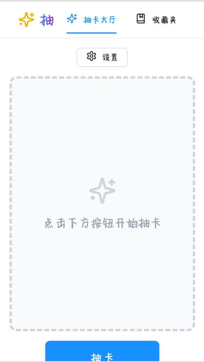
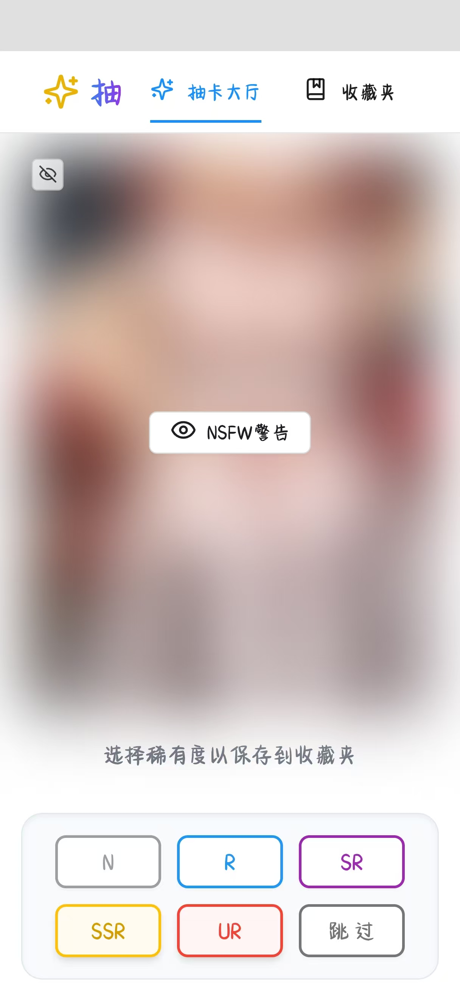
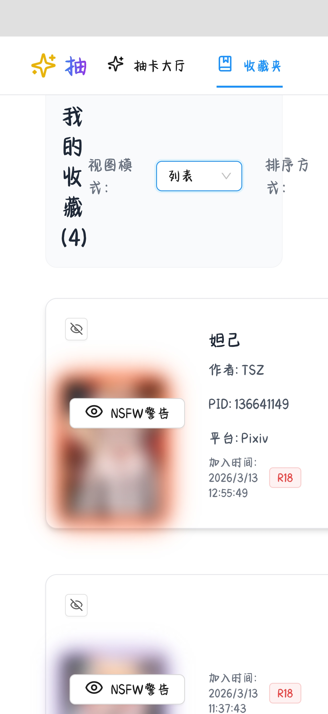

# 二次元抽卡应用

基于 React + TypeScript + Ant Design 构建的二次元图片抽卡系统。

## 界面预览






## 功能特性

### 抽卡系统
- 🎲 随机抽取二次元图片
- 🎨 支持 Pixiv 和 X (Twitter) 两个平台
- 🔞 R18 模式支持（默认开启）
- ⭐ 五级稀有度评级系统（N/R/SR/SSR/UR）
- ⏭️ 跳过按钮（不加入收藏直接抽下一张）

### 收藏管理
- 📁 收藏夹功能
- 🖼️ 三种视图模式：大图/小图/列表
- 📊 多种排序方式：最新优先/最旧优先/稀有度排序
- 📝 显示图片详细信息（标题、作者、PID、平台、加入时间）

### 图片处理
- 👁️ 图片模糊功能（R18 图片默认模糊）
- 🔍 点击图片放大预览
- 🎭 一键切换模糊/清晰状态

### 界面设计
- 📱 响应式布局
- ✨ 稀有度动态边框效果
- 🎯 抽屉式设置面板
- 🔄 加载动画

## 技术栈

- **前端框架**: React 18 + TypeScript
- **构建工具**: Vite
- **UI 组件库**: Ant Design
- **样式**: Tailwind CSS
- **路由**: React Router DOM
- **图标**: Lucide React
- **API**: Mossia API

## 开发指南

```sh
# 安装依赖
npm install

# 启动开发服务器
npm run dev

# 构建生产版本
npm run build

# 代码检查
npm run lint
```

## 项目结构

```
src/
  ├── components/     # 可复用组件
  │   ├── CardDisplay.tsx      # 卡片显示组件
  │   ├── CollectionItem.tsx   # 收藏项组件
  │   ├── Header.tsx           # 导航头部
  │   └── RatingPanel.tsx      # 评级面板
  ├── pages/         # 页面组件
  │   ├── Home.tsx             # 抽卡大厅
  │   └── Collection.tsx       # 收藏夹
  ├── types/         # TypeScript 类型定义
  └── index.css      # 全局样式
```

## API 接口

- **Pixiv**: `https://api.mossia.top/duckMo?num=1&r18Type={0|1}`
- **X (Twitter)**: `https://api.mossia.top/duckMo/x?num=1`

## 配置说明

### Vite 配置
- 服务器端口: 8080
- 允许所有主机访问
- 支持 IPv6

### 本地存储
- 收藏数据存储在 `localStorage` 的 `gacha_collection` 键中
- 数据格式: JSON 数组

## 部署

项目可以通过 Vercel、Netlify 或任何支持静态部署的平台进行部署。

构建后的文件位于 `dist/` 目录。
